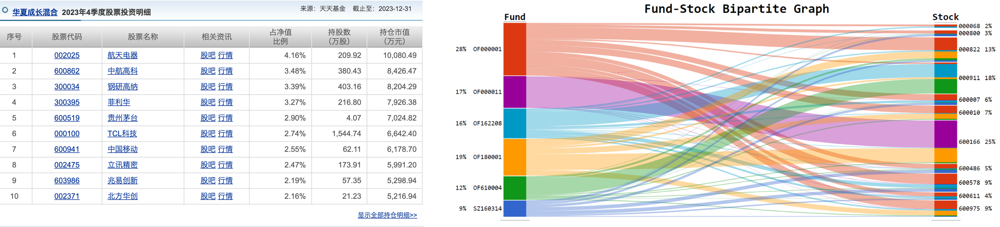
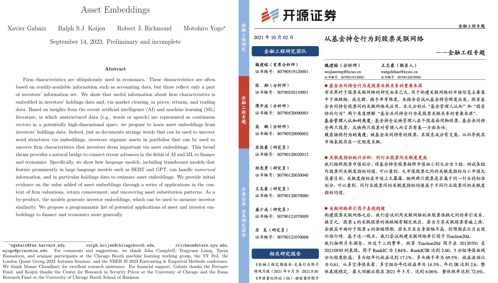
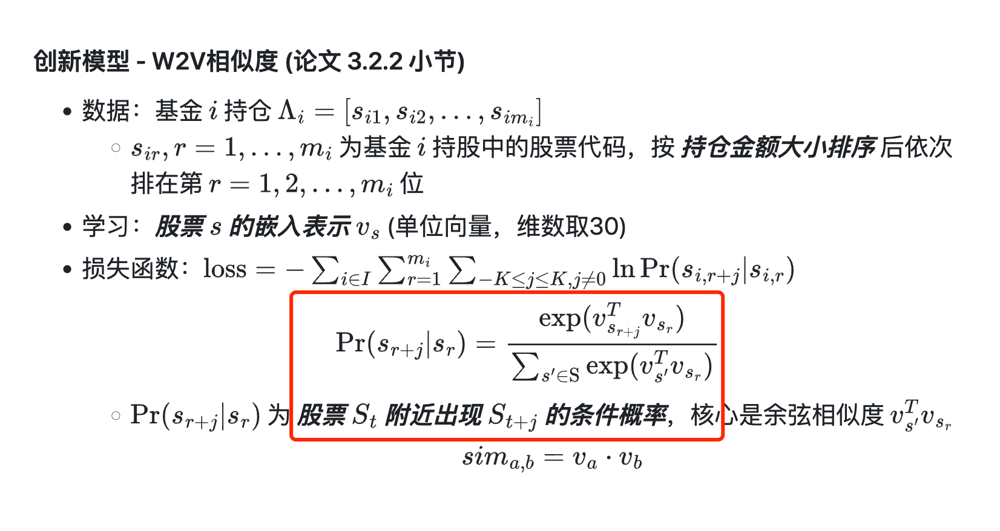
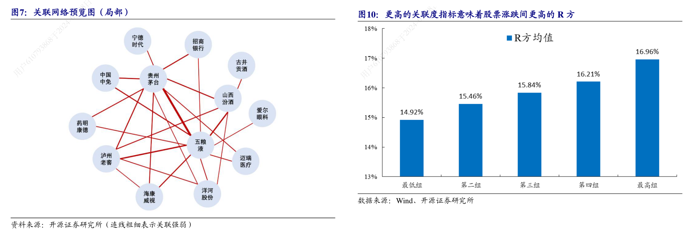
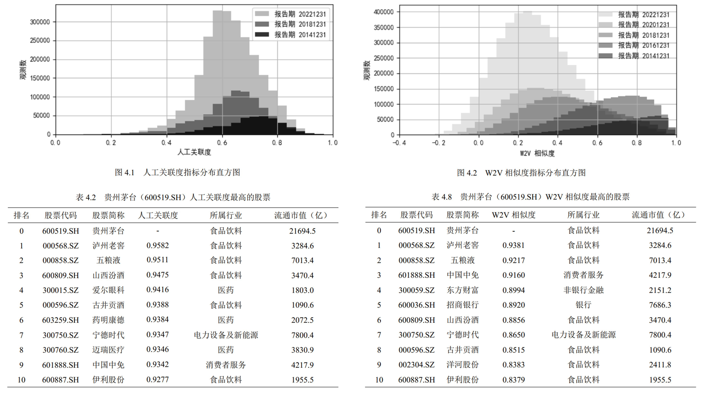
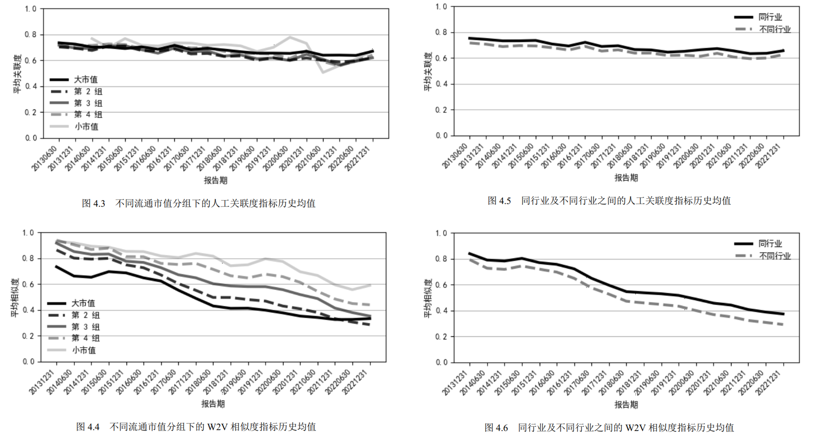
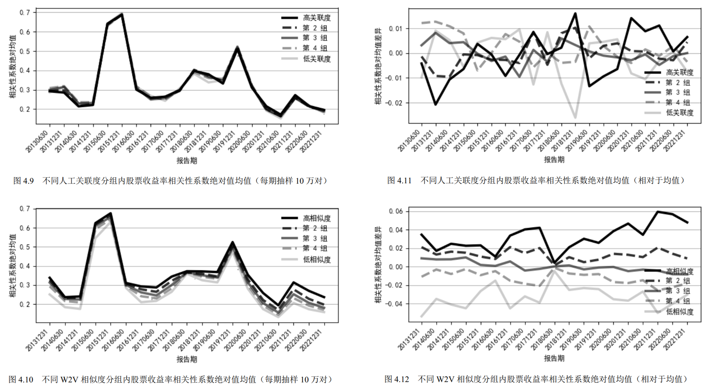
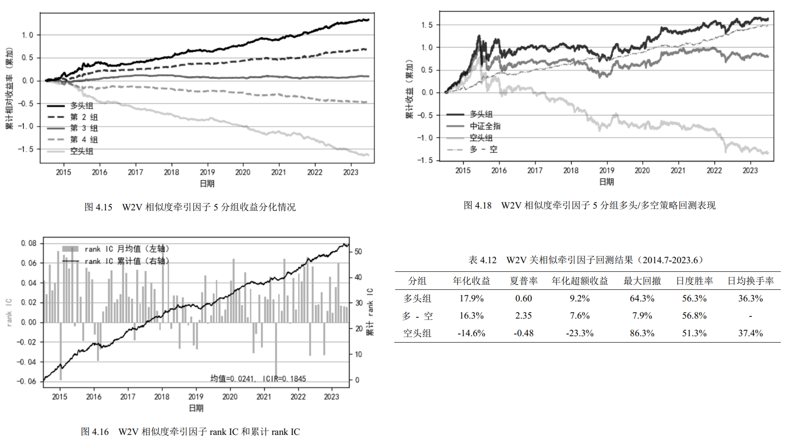
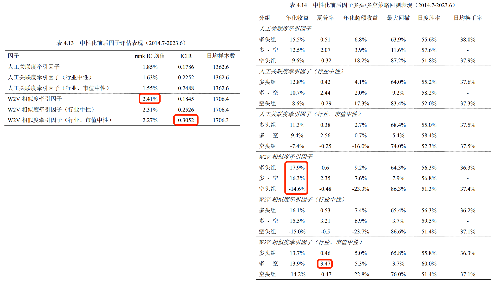

- [report](./doc/slides.pdf)
- [paper](./doc/paper.md)

---
marp: true
theme: default
size: 16:9

---
# 基金持股中的股票嵌入与股票关联

***STOCK EMBEDDINGS AND STOCK CORRELATION***
***FROM MUTUAL FUND HOLDINGS***

> wins-m  2024.5

---

## 目录

1. 问题背景
2. 研究假设
3. 研究方法
4. 研究结论
5. 研究启发

---

## 1. 问题背景

- 基金持股：公开市场信息，但不是结构化的股票特征
  - 问题一：基金持股能否体现主动基金的选股能力？若有，如何提取？

---

- 股票嵌入：学习股票特征向量
  - 问题二：基金持股中的公司特征能否被嵌入模型有效提取？
  - 问题三：对比已有文献中的人工提取，嵌入方法是否更有效？

---

**嵌入方法（Word2Vec）原理**

- “基金持仓-股票” v.s. “文本语句-单词”
  - A 经常在 B 附近出现：A 和 B 相似/相互替代
    > “宫殿里有国王和王后” 
  - A 和 B 都经常在 C 附近出现：A 和 B 相似/相互替代 
    > “国王站在台上”  “王后坐在台上” 
- 上下文关系相邻 v.s. 投资者需求、股东结构相似

---

- 股票关联：股票向量余弦距离 & 嵌入模型损失函数的关键
  - 问题四：提取获得的股票关联中蕴含哪些信息？受哪些公司特征影响？与股价收益率的关系？

---

- 关联动量：（1）相关性分析的统计结果；（2）模型评估的评判标准
  - 问题五：信息在公开披露后是否被市场价格充分反映？

---

## 1. 问题背景

- 基金持股：公开市场信息，但不是结构化的股票特征
  - 问题一：基金持股能否体现主动基金的选股能力？若有，如何提取？
- 股票嵌入：学习股票特征向量
  - 问题二：基金持股中的公司特征能否被嵌入模型有效提取？
  - 问题三：对比已有文献中的人工提取，嵌入方法是否更有效？
- 股票关联：股票向量余弦距离 & 嵌入模型损失函数的关键
  - 问题四：提取获得的股票关联中蕴含哪些信息？
- 关联动量：（1）相关性分析的统计结果；（2）模型评估的评判标准
  - 问题五：信息在公开披露后是否被市场价格充分反映？

---

## 2. 研究假设

1. 依赖**基金持股**信息，通过**人工或嵌入表示**的方法***能够获得***具有实际意义的**公司数值特征**。
2. 上述公司数值特征所刻画的**公司关联度**，***能够反映***股票的**风格暴露和行业分类**特征，并且与**未来的价格表现**相关。
3. 相比人工构造，**嵌入方法**在提取基金持股中股票的**显性特征**时***更加高效***，与风格暴露和行业分类之间的相关性更高。
4. 相比人工构造，**嵌入方法**在提取基金持股中股票的**隐性特征**时***更加高效***，与股票未来收益之间的相关性更高。
5. 通过基金持股信息获得的关联股票的未来收益之间***存在关联动量***，在控制公司风格特征后能够获得超额收益。

---

## 3. 研究方法

1. 模型建立：基金持股 (fund, stock, amount) --> 股票关联 (stock1, stock2, corr)
   - （1）人工构造（2）嵌入模型
1. 相关性分析：关联度指标统计性质
   - 关联度指标分布
   - 股票关联 vs. 风格特征 (*)
   - 股票关联 vs. 行业分类 (**)
   - 股票关联 vs. 收益相关性 (**)
2. 模型应用：关联股票收益相关（统计规律）--> 关联动量（定价异象）
   - 因子评估
   - Fama-MacBeth检验

---

### 模型

**基准模型 - 人工关联度 (论文 3.2.1 小节)**

- 基金对个股的影响力：$I^{i}_s=H^i_s/AMT_s$
  - $H_s^i$：基金 $i$ 对股票 $s$ 的持仓市值 
  - $AMT_s$：股票 $s$ 最近 20 日成交额均值
- 基金 $i$ 同时持仓股票 $a$ 和 $b$ 带来的关联强度：$J^i_{a,b}=\min({I^i_a,I^i_b})$
- 股票 $a$, $b$ 的关联度：$K_{a,b} = \sum_{i\in{\mathrm{Inst}}}{J^{i}_{a,b}}$
  - 规范化：$K^*_{a,b}=\frac{\ln{K} - \min{\ln{K}}}{\max{\ln{K}} - \min{\ln{K}}}$

---

**创新模型 - W2V相似度 (论文 3.2.2 小节)**

- 数据：基金 $i$ 持仓 $\Lambda_i = [s_{i1}, s_{i2}, \dots, s_{im_i}]$
  - $s_{ir}, r=1,\dots, m_i$ 为基金 $i$ 持股中的股票代码，按 ***持仓金额大小排序*** 后依次排在第 $r=1, 2, ..., m_i$ 位
- 学习：***股票 $s$ 的嵌入表示 $v_{s}$*** (单位向量，维数取30)
- 损失函数：$\mathrm{loss} = - \sum_{i\in I} \sum_{r=1}^{m_i} \sum_{-K\le j \le K, j\not=0}{ \ln \Pr(s_{i,r+j} | s_{i,r}) }$
    $$
    \Pr(s_{r+j}|s_{r}) = \frac{\exp(v_{s_{r+j}}^{T} v_{s_{r}})}{\sum_{s'\in \mathrm{S}}{\exp(v_{s'}^T v_{s_r})}}
    $$
  - $\Pr(s_{r+j}|s_{r})$ 为 ***股票 $S_t$ 附近出现 $S_{t+j}$ 的条件概率***，核心是余弦相似度 $v_{s'}^T v_{s_r}$
    $$
    {sim}_{a,b} = v_a \cdot v_b
    $$

---

## 4. 研究结论

1. 嵌入模型能有效利用基金持股数据提取公司数值特征，对股票关联进行定量刻画
2. 关联度：受行业分类、市值特征影响
   - 同行业，低于不同行业
   - 市值越高，平均关联度越低
   - 嵌入模型：分异更明显
3. 关联度：与未来股价相关
   - 嵌入模型：关联度更高，下季度收益相关性更高
   - 人工模型：无分异
4. 关联动量异象：基金持股隐含股票特征，且未被市价充分反映
   - 因子检验：持续有效
   - 嵌入模型：更显著
   - Fama MacBeth回归：不能被定价模型解释

---

### 4.1 嵌入模型能有效利用基金持股数据提取公司数值特征，对股票关联进行定量刻画

---

### 4.2  关联度：受行业分类、市值特征影响

- 同行业，高于不同行业；市值越高，平均关联度越低；嵌入模型：分异更明显

---

### 4.3 关联度：与未来股价相关

   - 嵌入模型：关联度更高，下季度收益相关性更高；人工模型：无分异

---

### 4.4 关联动量异象：基金持股隐含股票特征，且未被市价充分反映

**模型应用 - 因子构造 (论文 4.3.1 小节)**

① 取关联网络中所有样本股票过去 20 日复权开盘价涨跌幅，减去截面均值，刻画股票 $i$ 在过去 20 日的超额收益（式 4.2）

$$R^{20}_{i,t} = Open_{i,t} / Open_{i,t-19} - 1$$

$$AR_{i,t}^{20} = R_{i,t}^{20} - \frac{1}{n}\sum_{i=1}^{n}R^{20}_{i,t}$$

② 取股票 $i$ 所有关联股票 $j$ 的超额收益，根据关联度（或相似度）加权求和，获得所有股票过去 20 日来源于关联股票的 **预期超额收益**（式 4.3）

$$ER_{i,t} = \sum_{j\not=i}{AR_{i,t}^{20} \cdot \lambda_{i,j}}$$

其中 $\lambda_{i,j}$ 为最新基金持仓数据中股票 $i$ 和 $j$ 的关联度（相似度）

---

> ② 取股票 $i$ 所有关联股票 $j$ 的超额收益，根据关联度（或相似度）加权求和，获得所有股票过去 20 日来源于关联股票的预期超额收益（式 4.3）
> $$ER_{i,t} = \sum_{j\not=i}{AR_{i,t}^{20} \cdot \lambda_{i,j}}$$
> 其中 $\lambda_{i,j}$ 为最新基金持仓数据中股票 $i$ 和 $j$ 的关联度（相似度）

③ 每期截面上，预期超额收益对实际的过去 20 日超额收益，以及其他控制的风格、行业因子载荷进行回归（式 4.4）

$$ER_{i,t}^{20} = \beta_1 \cdot AR_{i,t}^{20}\ \left( + \sum_{k}{\beta_{k} f^{(k)}_{i,t}} \right) + \varepsilon_{i,t}$$

取残差 $\varepsilon_{i,t}$ 即得到关联动量牵引因子

---

   - 因子检验：持续有效

---

   - 嵌入模型：更显著

---

   - Fama MacBeth回归：不能被定价模型解释

---

## 5. 研究启发

- **基金持股** 数据蕴含股票特征信息，未能被市场充分关注。
- **嵌入方法** 能够提取基金持股等非结构化数据中的资产特征，有时优于人工构造。
- 股票特征的相似程度——**股票关联**，部分地被市值、行业等显性特征解释，额外也包含隐形的价格关联。

---

# 谢谢！
